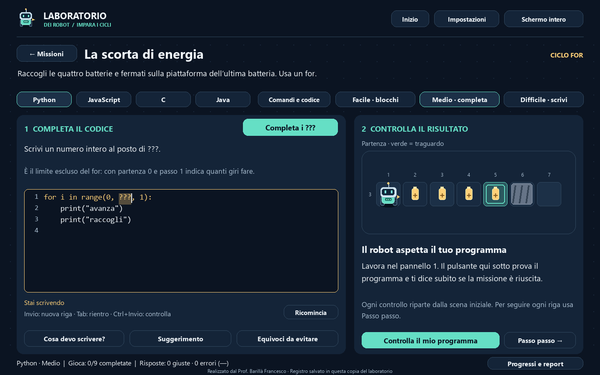
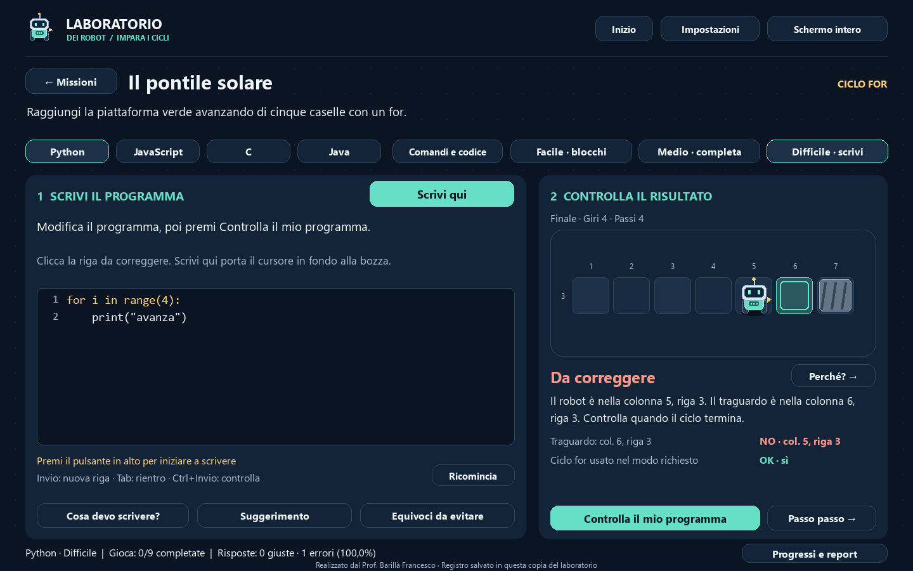

# Il laboratorio dei robot

Realizzato dal **Prof. Barillà Francesco**. Laboratorio offline per alunni di prima superiore: robot su una griglia, spiegazioni dei cicli ed esercizi in Python, JavaScript, C e Java.

## Avvio

Su GitHub scegliere **Code → Download ZIP** ed estrarre l'intera cartella scaricata. Il download include i sorgenti, **LaboratorioRobot.exe** e i due archivi nella cartella **dist**.

Aprire **LaboratorioRobot.exe nella cartella principale** oppure `Avvia_Robot.cmd`. Per gli alunni distribuire `dist/LaboratorioRobot-Windows.zip`: va estratto completamente in una cartella scrivibile. Non richiede installazione, account, connessione o compilatori. Eseguibile Windows x64.

I progressi personali (`progressi_cicli.json`) vengono creati dall'app e non sono pubblicati su GitHub. Le cartelle `build`, `__pycache__` e gli ambienti virtuali contengono file di lavoro generati sul computer e sono esclusi da Git.

Per avviare i sorgenti con Python 3.10 o successivo:

```text
python -m pip install -r requirements.txt
python main.py
```

## Percorso didattico

- **Impara**: leggi il codice e la scena, scegli una risposta fra tre e osserva il perché. Le nove domande allenano conteggio dei giri, ordine del corpo e momento del controllo. Risposta errata e spiegazione restano visibili; puoi riprovare. Una previsione corretta resta tale anche quando il robot non si sposta. Spiegami il ciclo apre la guida con concetti e confronto tra linguaggi.
- **Gioca**: due pannelli numerati distinguono programma e risultato. Facile: scegli numero o condizione, poi aggiungi e ordina le azioni del corpo. Medio: Completa i ??? seleziona solo il segnaposto e indica se scrivere un numero o un comando. Difficile: Scrivi qui attiva l'editor, con un esempio completo in Cosa devo scrivere?. Tutte le nove missioni restano accessibili nei tre livelli.
- **Verifica immediata**: Controlla i blocchi o Controlla il mio programma mostra subito Missione completata oppure Da correggere. Il confronto indica traguardo, oggetti o scansioni e uso del ciclo richiesto. Perché? apre il messaggio completo. Correggere il programma azzera la verifica precedente; ogni nuovo controllo parte dalla scena iniziale.
- **Passo passo**: una vista separata mostra riga, azione, giri, controlli e stato del robot. Puoi riprodurre, fermare e tornare indietro senza modificare bozza o selezione. L'osservazione della traccia e la lettura della soluzione non assegnano il completamento.
- **Equivoci da evitare**: scheda accessibile da Impara e Gioca. Spiega limite escluso del for, differenza fra azioni e giri, zero esecuzioni del while, primo giro obbligatorio del do while, sensori, negazione e cicli che non terminano.
- **Interfaccia**: corridoio ingrandito, cursore a mano, tre temi (Notte, Giorno, Contrasto), codice e spiegazioni ingrandibili, F11, velocità da 0.5× a 3×, ridimensionamento proporzionale e firma in ogni schermata. La scena mostra le righe occupate da robot, traguardo e oggetti, conservando le coordinate originali; se il robot cambia riga, la vista si amplia.





| Ciclo | Missioni | Concetti |
|---|---|---|
| for | Il pontile solare; La scorta di energia; Accendi la base | Limite escluso, più azioni per giro, ordine delle azioni |
| while | Il corridoio sicuro; Segui le batterie; Sei già arrivato | Sensori, controllo prima, zero esecuzioni |
| do while | Un messaggio dallo spazio; Partenza obbligatoria; Il controllo di conferma | Controllo dopo, almeno una esecuzione |

## Regole del gioco

L'obiettivo fisico da solo non basta. Il ciclo richiesto deve essere raggiunto e le azioni del robot devono avvenire al suo interno. Un ciclo inutilizzato, azioni eseguite manualmente fuori dal ciclo o un ciclo di altro tipo non superano la missione. Nei for è richiesta una ripetizione effettiva: un solo giro con tutte le azioni duplicate non basta. I cicli annidati dello stesso tipo sono supportati, ma non richiesti nelle missioni introduttive.

La missione del while con zero giri verifica che ci sia un comando avanza nel corpo e che la guardia distingua il traguardo da una posizione precedente: un while False vuoto non è una soluzione didattica. La missione di conferma richiede esattamente una scansione.

I controlli e le ripetizioni sono contatori didattici: non sono misure di prestazioni. Nel for Python il controllo rappresenta la disponibilità del prossimo valore di range. Nel do while equivalente in Python viene contato il controllo di uscita in fondo, senza contare la condizione costante True del contenitore while.

## Linguaggi: ambito dell'editor

È un **interprete didattico di frammenti**, non un IDE o un compilatore completo. Le istruzioni accettate sono mostrate nella scheda Comandi e codice. Lo studente scrive il frammento della missione senza import, definizioni, classi, main o accesso al sistema.

- Output standard: `print("avanza")`, `console.log("avanza");`, `printf("%s\n", "avanza");`, `System.out.println("avanza");`. La funzione stampa testo; il gioco anima il messaggio. Messaggi: avanza, sinistra, destra, raccogli, accendi, scansiona.
- Input esplicito 0/1: Python `strada_libera = int(input())`; JavaScript `let strada_libera = Number(prompt());`; C `int strada_libera; scanf("%d", &strada_libera);`; Java `int strada_libera = Integer.parseInt(input.nextLine());` con Scanner. Altre variabili di input: sulla_batteria, sul_traguardo, segnale_trovato. Il simulatore fornisce lo stato corrente solo alla lettura. In un programma esterno una persona inserisce gli stessi numeri in ordine. Il nome della variabile non crea un sensore nativo.
- Nel while leggi prima del ciclo e rileggi alla fine del corpo. Nel do while leggi dopo le azioni, prima del controllo finale. Usa confronti con 0 (validi anche in Java). Omettere una rilettura lascia il vecchio valore.
- I contatori della scena sono separati dalla memoria del programma. Per contare, inizializza e aggiorna una variabile locale.
- Comandi e codice mostra il programma completo: Python terminale, JavaScript console del browser con prompt, C con stdio.h/main, Java con Scanner e classe Main.
- Variabili intere, assegnazioni, `+=`, `-=`, confronti, `+`, `-`, `*`, condizioni logiche, `if/else`, `break`, cicli. Interi limitati all'intervallo -10000…10000; le stringhe sono ammesse per i messaggi di output; non sono disponibili divisione, array o funzioni definite dallo studente.
- Python: for su `range`, while, if con rientri. Il do while è mostrato come `while True` con controllo finale `if ...: break`. La condizione di uscita è il contrario di quella di ripetizione; si semplificano le doppie negazioni negli esempi.
- JavaScript, C, Java: blocchi con graffe obbligatorie, punto e virgola, for con contatore intero, confronto al limite e aggiornamento `++`, `--`, `+=`, `-=`. Dichiarazioni mostrate con `let` o `int`. Queste forme condividono un parser didattico: non vengono implementati tutti i sistemi di tipi, scope e conversioni dei linguaggi completi.

Le differenze del for sono rispettate: Python prepara range una volta e prende i valori successivi; il for classico ricontrolla il limite e aggiorna il contatore dopo il corpo. Cambiare il contatore nel corpo ha perciò effetti diversi. La traduzione automatica serve per i frammenti delle missioni: non garantisce equivalenza per tutti i programmi arbitrari, in particolare se cambiano limite o contatore nel corpo.

Il codice non viene passato a `eval`, `exec`, shell o runtime esterni. L'esecuzione è limitata a 1400 passaggi, 250 righe, 14000 caratteri e 12 livelli di annidamento. Superare il limite produce una pausa con diagnosi, non una dichiarazione automatica che il ciclo sia infinito.

## Salvataggi e tastiera

Preferenze, progressi e bozze vengono salvati atomicamente in `progressi_cicli.json`, accanto all'eseguibile (o al sorgente). I progressi distinguono missione, difficoltà e linguaggio; i blocchi sono condivisi tra i linguaggi. Ogni livello con editor ha la propria bozza per linguaggio. Se si cambia linguaggio, una bozza già esistente viene conservata; in sua assenza si traduce il codice valido. Un tentativo incompleto resta disponibile tornando al linguaggio precedente.

La modalità Impara non sovrascrive i tentativi del gioco. Le impostazioni conservano codice e posizione della simulazione. Ricomincia sostituisce il testo soltanto dopo conferma; un nuovo controllo ripristina la scena senza cancellare il programma.

F11 per schermo intero; Esc chiude le schede; Tab ed Invio navigano tra i pulsanti. Nell'editor Invio va a capo e Ctrl+Invio controlla il programma. Tab inserisce quattro spazi, Ctrl+A/C/X/V selezionano e usano gli appunti, Ctrl+Z/Y annullano e ripristinano. Le frecce muovono il cursore; Shift estende la selezione. La rotella scorre verticalmente, Shift+rotella orizzontalmente, anche nella traccia. Le spiegazioni supportano anche Home, End e Pagina su/giù.

## Struttura e ricostruzione

- `main.py`: navigazione, missioni, simulazione e interazioni.
- `guidance.py`: consegne, previsioni, equivoci ed esempi nei quattro linguaggi.
- `guided_ui.py`: pannelli di gioco e apprendimento, controlli e traccia separata.
- `engine.py`: parser, rappresentazione dei cicli, generazione del codice e interprete con stato verificabile.
- `missions.py`: nove missioni, soluzioni e suggerimenti.
- `lessons.py`: testi originali delle spiegazioni.
- `ui.py`: disegno vettoriale del robot, griglia, temi, editor.
- `storage.py`: salvataggi validati.
- `tests/test_robot_lab.py`: verifiche del motore, delle regole e delle interazioni.
- `tests/test_guidance.py`: selezione e scrittura, verifica, previsioni, conservazione delle bozze e riproduzione senza premi.

```text
python -m unittest discover -s tests -v
python main.py --smoke-test smoke.json
python main.py --smoke-test smoke.json --screenshots screenshots
python -m pip install pyinstaller==6.20.0
python build_release.py
```

`build_release.py` esegue i test, costruisce LaboratorioRobot.exe, verifica l'eseguibile senza aprire finestre e produce i due ZIP in dist. Non include i progressi personali negli archivi. Chiudere il programma prima di ricostruire il suo eseguibile. Il file `LaboratorioRobot.spec` e l'icona originale sono inclusi nei sorgenti.

## Riferimenti per la didattica

Sintassi e differenze sono state confrontate con la [documentazione Python](https://docs.python.org/3/reference/compound_stmts.html), le [specifiche ECMAScript](https://tc39.es/ecma262/multipage/ecmascript-language-statements-and-declarations.html#sec-iteration-statements), la [Java Language Specification](https://docs.oracle.com/javase/specs/jls/se25/html/jls-14.html) e la [bozza pubblica C11 N1570, §6.8.5](https://www.open-std.org/jtc1/sc22/wg14/www/docs/n1570.pdf). I testi del laboratorio e la grafica sono originali; le licenze dei componenti distribuiti sono in LICENZE.txt.

Le vecchie bozze con funzioni del gioco vengono conservate: il controllo spiega come correggerle usando output e input standard.


PROGRESSI E REPORT PER IL DOCENTE
Il pulsante Progressi e report è sempre in basso. Mostra missioni Gioca
completate, risposte corrette, errori e percentuale di errore:
errori / risposte effettivamente controllate x 100. Senza risposte compare —.
Impara, Gioca e Quiz sono distinti. Ogni verifica del programma conta come
un tentativo, non come un tentativo per ciascun caso automatico.
Ripetere lo stesso controllo senza cambiare risposta non aggiunge tentativi;
una risposta modificata viene contata. Rivedere una traccia non conta.
Sono visibili anche aiuti e soluzioni consultati. I vecchi completamenti
restano; non vengono inventati tentativi o errori antecedenti all'aggiornamento.
Inserisci facoltativamente un nome/codice: identifica l'intero storico di
questa copia. Esporta report CSV crea un file nella cartella report accanto
ai progressi, con tutti i linguaggi/livelli e dettaglio delle attività.
Il registro è locale e modificabile, non sincronizzato né una prova
antimanomissione. Per il controllo in classe, raccogli i CSV degli studenti.
